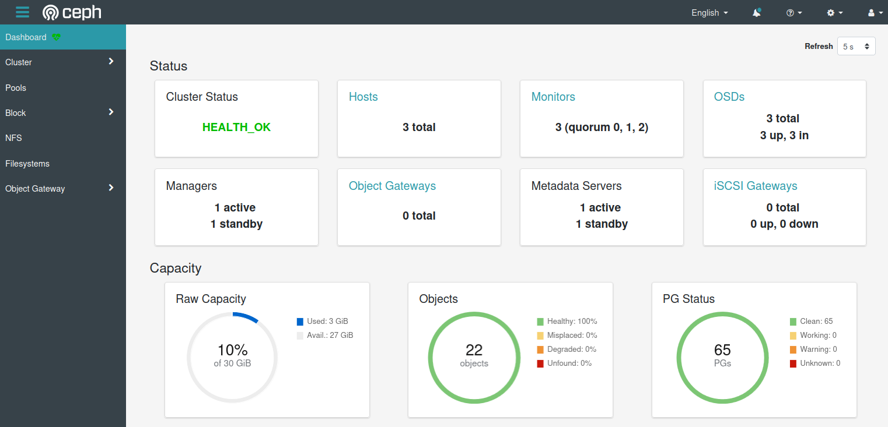

# Docker Swarm + Ceph Cluster on Vagrant/Virtualbox

A three node Docker Swarm cluster, featuring a distributed Ceph OSD file system, for sandbox/playground purposes. Inspired by [Funky Penguin's](https://geek-cookbook.funkypenguin.co.nz) beautiful blog articles.

## Dependencies
- A (preferably) *nix based host system (tested on Ubuntu 23.10)
- VirtualBox >= 7.0
  - Ensure a `host-only` network is created in VirtualBox, with an IPv4 Address of: 192.168.56.1
- Vagrant >= 2.4.0

## TLDR Setup

Run:
```shell
$ start.sh
```
and pray to the demo gods.

## End Goal

Found at `https://<manager node IP>:8443`, defaults to https://192.168.56.3:8443 (user: admin, password: admin).



## Troubleshooting

### Ceph VMDK not properly attached to nodes
Look in the Vagrantfile, for the following line:
```ruby
vb.customize ['storageattach', :id, '--storagectl', 'SCSI', '--port', 2, '--device', 0, '--type', 'hdd', '--medium', file_to_disk]
```
and adjust the `--storagectl `, `--port` and `--device` values accordingly, based on what VirtualBox shows in the VM settings.

### You can't get HEALTH_OK on Ceph due to MON_CLOCK_SKEW errors in Ceph dashboard
I faced a few issues with time sync between the VMs. I installed chrony and force-sync the time during setup.
If you still face issues, try to manually sync the time on all nodes:
```shell
$ vagrant ssh <node>
$ sudo chronyc -a makestep 0.1 -1
```
You can ceck the time on nodes using (duh!):
```shell
$ date
```
Wait for a bit, HEALTH_OK should eventually appear.

